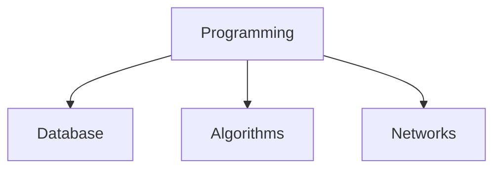
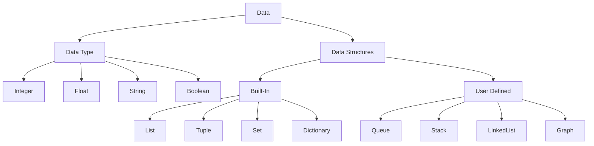

# ComputerProgramming


Concept Flowchart





---
<table>
<tr>
<th>Java Code</th>
<th>C++ Code</th>

</tr>
<tr>
<td>

```java
//  Java Source Code to print "Hello World"

class HelloWorld {
    public static void main(String[] args) {
         System.out.println("Hello, World! - Java "); 

    }
}
```

</td>
<td>
  
```cpp
 
//  C++ Source Code to print "Hello World"

#include <iostream>
using namespace std; 
int main() {
    cout << "Hello World! -C++";
    return 0;
}

```
  
 
</td>
</tr>
</table>

---

<table>
<tr>
<th>Python Code</th>
<th>Swift Code</th>

</tr>
<tr>
<td>

```py
#  Python/Swift Source Code to print "Hello World"

print("Hello, world! -Python/Swift ")
  
```

</td>
<td>
  
```js
 
// JavaScript Source Code to print "Hello World"

alert( "Hello, world! -JavaScript" );
  
```
  
 
</td>
</tr>
</table>

---
